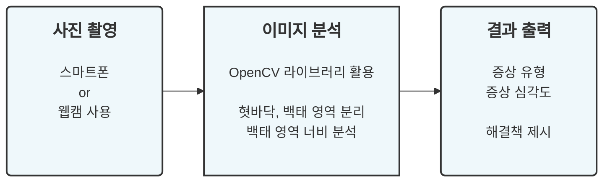

# 설진을 통한 건강상태 자가진단(Team :P)  
## 프로젝트 요약
혀 사진을 통해 건강상태를 진단하는 '설진'으로 자가진단 스마트 헬스케어 서비스를 제공하는 프로젝트입니다.  

## 구현 방법
자세한 이미지 분석 과정을 나타낸 플로우 차트입니다.  

```mermaid
graph
A(<b><span style='font-size:18px'>Image</span></b>)-->B[<b><span style='font-size:20px'>Resize<br>640 * 640</span></b>]
B-->C[<b><span style='font-size:18px'>Homomorphic<br>Filtering</span></b>]
C-->D1[<b><span style='font-size:18px'>Resize<br>120 * 120</span></b>]
D1-->E1[<b><span style='font-size:18px'>Meanshift<br>영역분할</span></b>]
E1-->F1[<b><span style='font-size:18px'>Gaussian<br>Smoothing</span></b>]
F1-->G[<b><span style='font-size:18px'>Canny<br>Edge 검출</span></b>]
G-->H[<b><span style='font-size:18px'>Dilate<br>&<br>Erode</span></b>]
H-->I[<b><span style='font-size:18px'>Resize<br>640 * 640</span></b>]
I-->J[<b><span style='font-size:18px'>Binarization</span></b>]

C-->D2[<b><span style='font-size:18px'>Resize<br>640 * 640</span></b>]
D2-->E2[<b><span style='font-size:18px'>HSV기준 배경제거</span></b>]
E2-->F2[<b><span style='font-size:18px'>전경 공백<br>Interpolation</span></b>]

J-->K
F2-->K[<b><span style='font-size:18px'>if img_bin==0:<br>img_h=0</span></b>]
K-->L[<b><span style='font-size:18px'>Labeling</span></b>]
L-->M[<b><span style='font-size:18px'>이미지의 중앙<br>Label만 선택</span></b>]
M-->N[<b><span style='font-size:18px'>Label 공백<br>Interpolation</span></b>]
N-->O1[<b><span style='font-size:18px'>상하 영역 분할<br>기준점 탐색</span></b>]

C-->O2
N-->O2[<b><span style='font-size:18px'>img_homomorphic에<br>Label 적용</span></b>]
O2-->P1[<b><span style='font-size:18px'>H</span></b>]
O2-->P2[<b><span style='font-size:18px'>S</span></b>]
O2-->P3[<b><span style='font-size:18px'>V</span></b>]
P2-->Q[<b><span style='font-size:18px'>S 평균 기준<br>Binarization</span></b>]
O1-->R
Q-->R(<b><span style='font-size:18px'>백태 영역 비율 계산</span></b>)


style A fill:#EFF8FB ,stroke:#333,stroke-width:2px
style B fill:#EFF8FB ,stroke:#333,stroke-width:2px
style C fill:#EFF8FB ,stroke:#333,stroke-width:2px
style D1 fill:#EFF8FB ,stroke:#333,stroke-width:2px
style E1 fill:#EFF8FB ,stroke:#333,stroke-width:2px
style F1 fill:#EFF8FB ,stroke:#333,stroke-width:2px
style G fill:#EFF8FB ,stroke:#333,stroke-width:2px
style H fill:#EFF8FB ,stroke:#333,stroke-width:2px
style I fill:#EFF8FB ,stroke:#333,stroke-width:2px
style J fill:#EFF8FB ,stroke:#333,stroke-width:2px

style D2 fill:#EFF8FB ,stroke:#333,stroke-width:2px
style E2 fill:#EFF8FB ,stroke:#333,stroke-width:2px
style F2 fill:#EFF8FB ,stroke:#333,stroke-width:2px

style K fill:#EFF8FB ,stroke:#333,stroke-width:2px
style L fill:#EFF8FB ,stroke:#333,stroke-width:2px
style M fill:#EFF8FB ,stroke:#333,stroke-width:2px
style N fill:#EFF8FB ,stroke:#333,stroke-width:2px
style O1 fill:#EFF8FB ,stroke:#333,stroke-width:2px

style O2 fill:#EFF8FB ,stroke:#333,stroke-width:2px
style P1 fill:#EFF8FB ,stroke:#333,stroke-width:2px
style P2 fill:#EFF8FB ,stroke:#333,stroke-width:2px
style P3 fill:#EFF8FB ,stroke:#333,stroke-width:2px
style Q fill:#EFF8FB ,stroke:#333,stroke-width:2px
style R fill:#EFF8FB ,stroke:#333,stroke-width:2px
```

## 실제 동작
<left></left>
<right></right>

* 사용된 혀 이미지 출처: [White Tongue: Definition, symptoms, causes & treatment](https://www.acko.com/health-insurance/white-tongue/)
