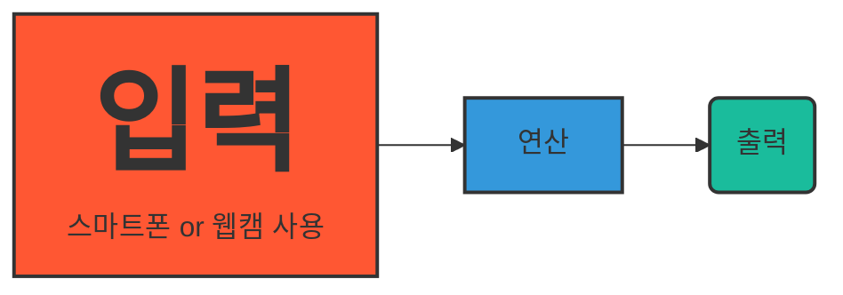

# 설진을 통한 건강상태 자가진단(Team :p)  
## 프로젝트 요약

```mermaid
graph LR
A[<b><span style='font-size:64px'>입력</span></b>\n스마트폰 or 웹캠 사용] --> B[연산]
B --> C(출력)

style A fill:#FF5733,stroke:#333,stroke-width:2px
style B fill:#3498db,stroke:#333,stroke-width:2px
style C fill:#1abc9c,stroke:#333,stroke-width:2px

```
## 구현 방법
## 실제 동작
